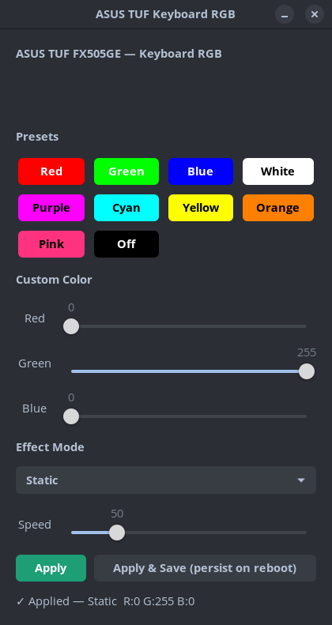

# ASUS TUF FX505GE — Keyboard RGB Controller for Linux


A GTK-based GUI app to control the keyboard RGB backlight on the ASUS TUF FX505GE under Linux, using the `asus-nb-wmi` kernel module's sysfs interface.


---

## Confirmed working on

| Laptop | OS | Kernel | Desktop |
|--------|-----|--------|---------|
| ASUS TUF FX505GE (GTX 1050 Ti, i5-8300H) | Pop!_OS 24.04 LTS | 7.0.11-76070011 | COSMIC |

> If you get this working on another ASUS TUF model or distro, please open an issue or PR and I'll add it to the table.

---

## Background

The FX505GE uses a WMI-controlled RGB keyboard (not USB), so tools like **OpenRGB** and **rogauracore** do not work. The correct interface is the `asus-nb-wmi` kernel module which exposes RGB control via sysfs.

The sysfs write format was determined through testing:

```
/sys/devices/platform/asus-nb-wmi/leds/asus::kbd_backlight/kbd_rgb_mode
Format: cmd mode R G B speed
```

| Field | Description |
|-------|-------------|
| `cmd` | Always `0` |
| `mode` | `0`=static, `1`=breathing, `2`=color cycle |
| `R G B` | 0–255 each, standard RGB order |
| `speed` | 0–255, used for breathing and color cycle |

> **Note:** Mode `3` (strobe) is accepted by the kernel but silently ignored by the FX505GE firmware.

---

## Features

- 10 color presets with accurate button color previews
- Custom RGB sliders for any color
- Three effect modes: Static, Breathing, Color Cycle
- Speed control for animated effects
- Live color preview bar
- **Apply** — applies immediately without saving
- **Apply & Save** — creates a systemd service so the color persists automatically after every reboot

---

## Requirements

- Linux with kernel ≥ 5.3 (asus-nb-wmi included)
- Python 3
- GTK 3 (`python3-gi`, `gir1.2-gtk-3.0`)

---

## Installation

```bash
git clone https://github.com/YOUR_USERNAME/asus-tuf-fx505ge-rgb.git
cd asus-tuf-fx505ge-rgb
chmod +x install.sh
./install.sh
```

Then launch from your app menu by searching **"ASUS Keyboard RGB"**, or run:

```bash
python3 /opt/asus-rgb/asus_rgb.py
```

---

## Uninstall

```bash
chmod +x uninstall.sh
./uninstall.sh
```

---

## Manual usage (no install)

If you just want to set a color from the terminal without the GUI:

```bash
# Static red
echo "0 0 255 0 0 0" | sudo tee /sys/devices/platform/asus-nb-wmi/leds/asus::kbd_backlight/kbd_rgb_mode

# Breathing blue
echo "0 1 0 0 255 80" | sudo tee /sys/devices/platform/asus-nb-wmi/leds/asus::kbd_backlight/kbd_rgb_mode

# Color cycle
echo "0 2 0 0 0 50" | sudo tee /sys/devices/platform/asus-nb-wmi/leds/asus::kbd_backlight/kbd_rgb_mode

# Activate (apply to all power states)
echo "0 1 1 1 1" | sudo tee /sys/devices/platform/asus-nb-wmi/leds/asus::kbd_backlight/kbd_rgb_state
```

---

## Troubleshooting

**App won't launch from app menu**
Run from terminal first to see errors:
```bash
python3 /opt/asus-rgb/asus_rgb.py
```

**"Failed" message when clicking Apply**
Make sure install.sh was run to set up the sudoers rule. Verify with:
```bash
sudo cat /etc/sudoers.d/asus-rgb
```

**RGB path not found**
Check if asus-nb-wmi is loaded:
```bash
lsmod | grep asus_nb_wmi
ls /sys/devices/platform/asus-nb-wmi/leds/
```

**Keyboard not detected (different model)**
If your ASUS laptop uses a USB RGB controller instead of WMI, check `lsusb | grep -i asus`. If an ASUS device appears, try [OpenRGB](https://openrgb.org) or [rogauracore](https://github.com/wroberts/rogauracore) instead.

---

## Fan control

The FX505GE fan boost mode is controlled separately via:

```bash
# Read current mode (0=balanced, 1=turbo, 2=silent)
cat /sys/devices/platform/asus-nb-wmi/fan_boost_mode

# Set turbo
echo 1 | sudo tee /sys/devices/platform/asus-nb-wmi/fan_boost_mode
```

Fn+F5 also cycles through modes if asus-nb-wmi is loaded.

---

## License

MIT — free to use, modify, and share.
